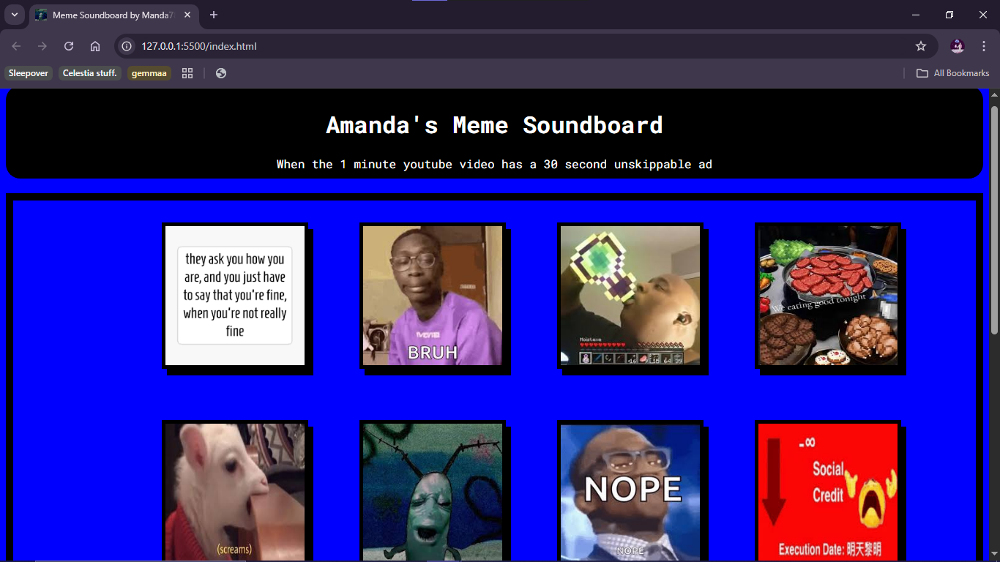

# MEME SOUND BOARD
YEAH, I DIDN'T GET ENOUGH OF CLICKS TRIGERRING EVENTS IN JAVASCRIPT

This meme soudboard is just a way to kill time
There are prompts that you can try to think of a meme sound to play or you can just use it as a meme soundboard. The choice is yours. 

Please note that some of the prompts might not be actuslly funny and it is hard to come up with prompts for memes like vine boom and social credit. Thank you.

Also, I think math.random is biased because sometimes it repeats prompts(Edit: It isn't biased, randomness is actually just weird)

I used CSS grid like I learned in the Whack-A-Gopher project. It was a really fun way to make styling even. Background shadows and hover animations go a long way.
Javascript has an array of meme prompts, picks a random one then changed the empy span tag to that meme(.innertext is safer than .innerhtml apparently).

As always, I added a favicon. Favicons make even the most basic projects look much more polished.

You just click on a meme and it plays a sound(It took me too long to source all the souds).
This was a really fun, laid back project and I'm pleased with how it turned out, on to the next one!.
I also learned my lesson from last time(Vercel 404) and named my html main as index.html so I do not have to manually configure the root file in Vercel again

# Here's what it looks like:

# I made this with the help of: 

